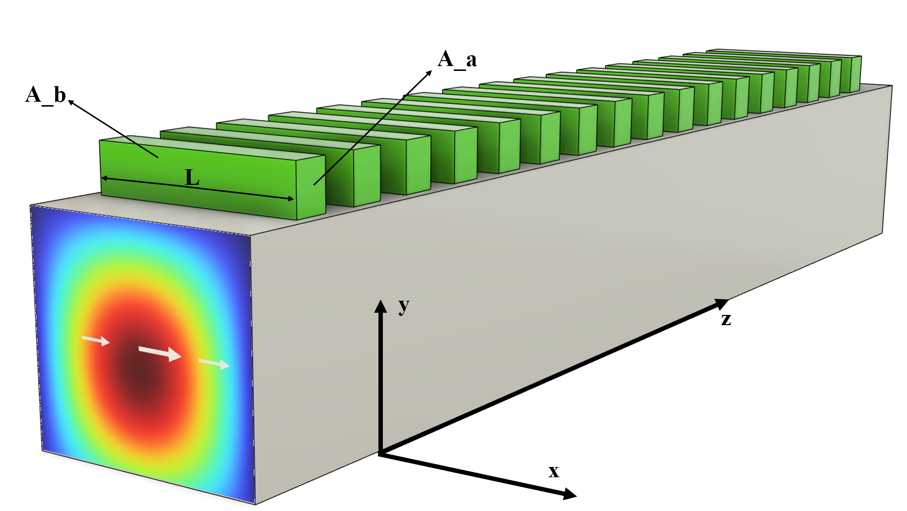
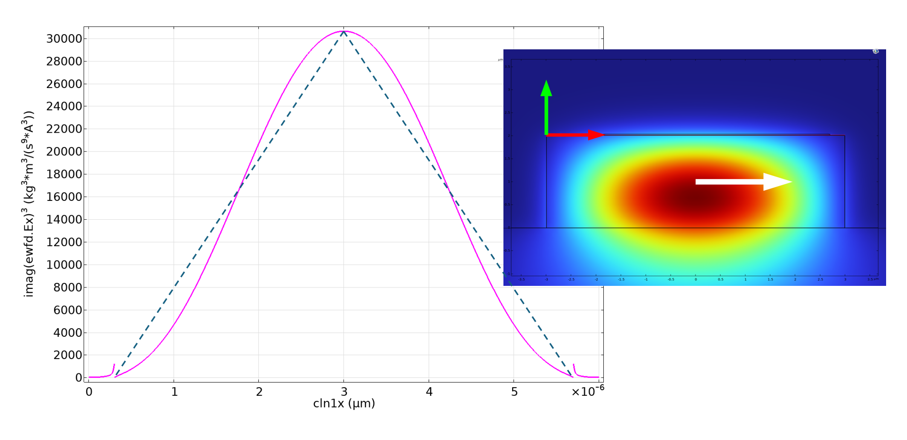

# Dipole Antenna Model 

I make this blog to help myself and others understand how exactly our radiators work. 

The picture above shows the setup. A waveguide is pumped by a TE fundamental mode. On top of the waveguide, we deposit strips of nonlinear material(TiO2), whose length are L, and their width(dz) and height(dz) are way smaller than L. Therefore, as a first order approximation, each green strip is treated as a 1D linear antenna with length L. 

## Total Power Radiated by a Radiator

Each green strip is modeled as a conducting wire of length $L$. As the TE mode propagates through the waveguide, the material experiences a displacement current driven by the evanescent field. The power radiated by such a wire is fundamentally determined by its current distribution $I(x)$. And I will state without proof for two classic short dipole antenna models assuming $L\leq\lambda$.

$$
P_{rad} = \begin{cases} 
\eta \frac{\pi}{3} \left( \frac{I_0 L}{\lambda} \right)^2 & \text{if } I(x) = I_0 \text{ (Uniform)} \quad \\
\eta \frac{\pi}{12} \left( \frac{I_0 L}{\lambda} \right)^2 & \text{if } I(x) \approx I_0 \left( 1 - \frac{2|x|}{L} \right) \text{ (Triangular)} 
\end{cases}
$$

This is the equation where we used in our proposal(Kerry uses the Triangular one). Yet it has two big problems. 

**1. These two models, derived from Balanis' Antenna Theory, differ by a factor of 0.25 due to the integration of their respective current profiles. While neither perfectly accounts for the current distribution induced by a non-uniform evanescent field, they serve as a robust first-order approximation. Consequently, the primary challenge lies in accurately determining the effective current $I(x)$.**

**2. Since the mode propagates in the $z$-direction and the radiator is oriented along the $x$-direction at a fixed $z_0$, the driving field reaches all points along the radiator simultaneously. Thus, the displacement current $I(x, t)$ is completely in-phase along the $x$-axis. The radiator acts as an in-phase broadside line source with a amplitude distribution followed by the TE mode distribution at the radiator. However, because its length $L \approx 33\lambda$ is much greater than the wavelength, short-dipole models (which assume $L \ll \lambda$) fail. The total radiated power must be evaluated by integrating the far-field pattern generated by this highly directive, in-phase current distribution.**

I need to think more to derive a model that describes a 1.long, 2.in-phase, 3.current distribution determined by TE mode distribution, antenna model but clearly what I can tell is it is no longer scaling as $(L/\lambda)^2$. It is most likely a $(L/\lambda)$ dependence. There is optimization and further simulation in this antenna that could be done to improve the efficiency.

---
We assume a radiator with small cross section($A_a$), so that the current density is uniform in the cross section y-z plane.(!!!!This assumption might be incorrect because in the mask I drew, dz is ~150nm, dy is ~30nm. The field will vary in z direction)**. The net current flowing in a radiator is simply given by area times current density. However, since the electric field is not uniform across the x-direction, the current is not necessarily a constant of x. (y0,z0) is where the radiator is located. 

$$
    I(x,t)  = A_a \cdot J_{disp}(x,y_0,z_0,t)
$$

$$
    J_{disp}(x,t) = \frac{\partial}{\partial t}\{\epsilon \cdot \chi^{(3)} \cdot E_{450}(x,y_0,z_0,t)^3 \}
$$

The driving TE mode field at the position of the radiator is expressed as:

$$E_{450}(x, y, z, t) = E_{450}^0 \cdot f(x, y) \cdot \cos{(kz - \omega t)}$$

**Where:**

* **$E_{450}^0$**: Peak electric field amplitude of the TE mode.
* **$f(x, y)$**: Normalized transverse mode profile.
* **$kz - \omega t$**: Phase term for a wave traveling in the $+z$ direction.

---
Taking the cube of $E_{450}$ while only keeping track of the third harmonic term: 

$$
E_{450}(x, y_0, z_0, t)^3 \bigg|_{3\omega} = \frac{1}{4} \left( E_{450}^0 f(x, y_0) \right)^3 \cos(3\omega t)
$$

for simplicity, kz component is dropped. 

??? note "Proof"
    Let $\theta = kz_0 - \omega t$:
    $$
    E_{450} = E_{450}^0 f(x, y_0) \left( \frac{e^{i\theta} + e^{-i\theta}}{2} \right)
    $$

    $$
    E_{450}^3 = (E_{450}^0 f(x, y_0))^3 \frac{1}{8} (e^{i\theta} + e^{-i\theta})^3
    $$

    $$
    (e^{i\theta} + e^{-i\theta})^3 = e^{i3\theta} + 3e^{i2\theta}e^{-i\theta} + 3e^{i\theta}e^{-i2\theta} + e^{-i3\theta}
    $$

    $$
    (e^{i\theta} + e^{-i\theta})^3 = (e^{i3\theta} + e^{-i3\theta}) + 3(e^{i\theta} + e^{-i\theta})
    $$

    $$
    E_{450}^3 = \frac{1}{8} (E_{450}^0 f(x, y_0))^3 [ (e^{i3\theta} + e^{-i3\theta}) + 3(e^{i\theta} + e^{-i\theta}) ]
    $$

    $$
    E_{450}^3 = \frac{1}{4} (E_{450}^0 f(x, y_0))^3 \cos(3\theta) + \frac{3}{4} (E_{450}^0 f(x, y_0))^3 \cos(\theta)
    $$

    $$
    E_{450}^3 \bigg|_{3\omega} = \frac{1}{4} (E_{450}^0 f(x, y_0))^3 \cos(3kz_0 - 3\omega t)
    $$

Plug This back to obtain the current expression:

$$
    I(x,t) = \{ \epsilon \cdot A_a \cdot \chi^{(3)} \}\cdot \{ \frac{3\omega}{4}\}\cdot\{E_{450}^0 \cdot f(x,y_0)\}^3\cdot\{-\sin(3\omega t)\}
$$

$$
    I_0(t) = \{ \epsilon \cdot A_a \cdot \chi^{(3)} \}\cdot \{ \frac{3\omega}{4}\}\cdot\{E_{450}^0 \cdot f(0,y_0)\}^3\cdot\{-\sin(3\omega t)\}
$$

The current distribution is proportional to $f^3$. Therefore, the spatial profile $f(x,y_0=15nm)$ determines the current distribution. As it is hard to express it analytically at 15nm above the top of the waveguide(considering a 30nm thick TiO2, 15nm is the center), I use FEM simulation to numerically plot $f^3$. The pink is the distribution.

**The electric field distribution is more or less like a gaussian distribution instead of a linear distribution. Since the radiated power is proportional to the area bounded by the distribution, a triangular current model $P_{rad}=\eta \frac{\pi}{12} \left( \frac{I_0 L}{\lambda} \right)^2$ is a good enough approximation of the power.**

Substituting the instantaneous current $I_0(t)$ into the triangular radiation model to find the **instantaneous radiated power** $P_{rad}(t)$:

$$
P_{rad}(t) = \{ \eta \frac{\pi}{12} \} \cdot \{ \frac{L}{\lambda_{150}} \}^2 \cdot  \{ \frac{3\omega}{4} \}^2  \cdot \{ \epsilon_0 A_a \chi^{(3)} \}^2 \cdot \{ E_{450}^0 f(0,y_0) \}^6 \cdot \{ \sin^2(3\omega t) \}
$$

$$
<P_{rad}> = \{ \eta \frac{\pi}{12} \} \cdot \{ \frac{L}{\lambda_{150}} \}^2 \cdot   \{ \frac{3\omega}{4} \}^2 \cdot \{ \epsilon_0 A_a \chi^{(3)} \}^2 \cdot \{ E_{450}^0 f(0,y_0) \}^6 \cdot \{ \frac{1}{2}\}
$$

