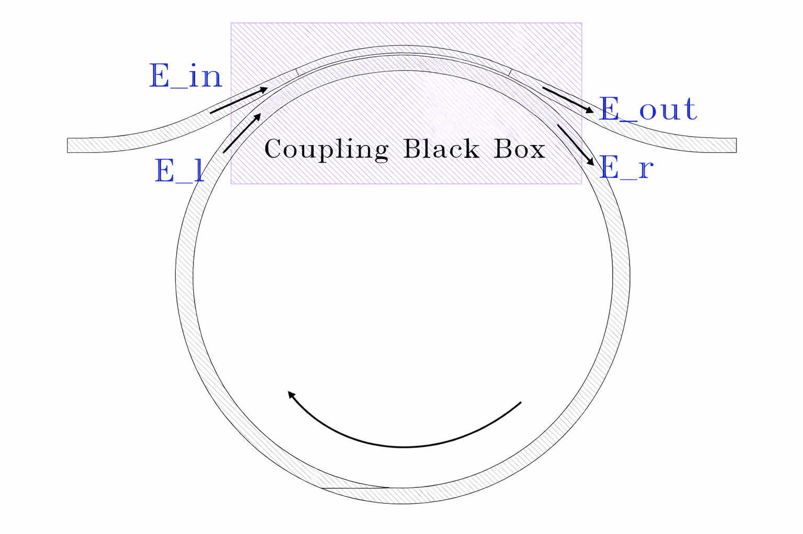
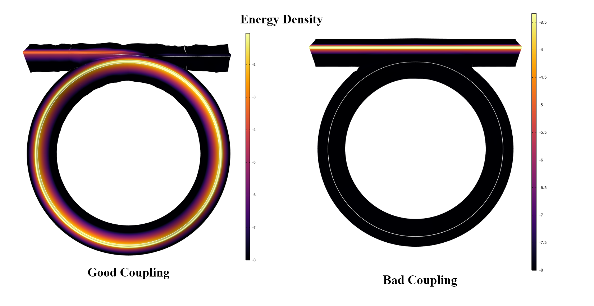
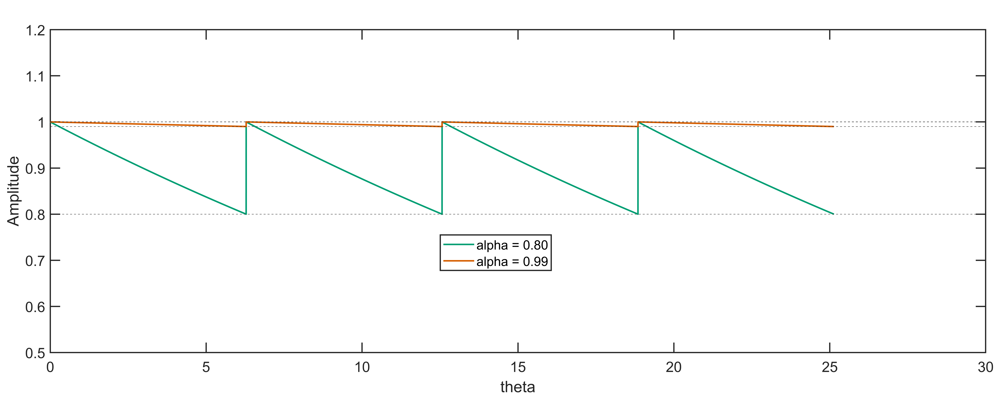
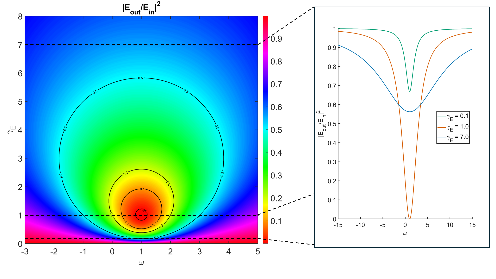

# Macroscopic description of a ring resonator with a coupler

Ring resonator is the basic component in photonics. It usually consists of a ring and a bus waveguide that sends electromagnetic wave into the ring and generates resonance inside. This section describes the macroscopic process of how a plane wave $e^{iwt}$ is coupled into the ring. In principle, the knowledge here is universal to any resonator plus coupler structure. It could be a simple two-mirror cavity, a LC resonator circuit, or any microwave cavity structure. 

Going back to the ring, below is a typical structure that we are going to analyze. We are sending a plane wave($E_{in}$) through the input port. Part of it couples into the right side of the ring($E_{r}$), circulates to the left side($E_{l}$), and eventually recouples back to the bus waveguide and interfere with the transmitted($E_{in}$) to produce the output field($E_{out}$)

Under certain coupling condition, you are going to see all of the energy are efficiently coupled into the resonator to generate resonance. None of them is coming out of the output port--all consumed by the resonator. The resonance can build up tremendous energy density inside the resonator, and can possibly amplifying the power by 10000x depending on how good your ring is. Such amplification is powerful in enhancing light and material interaction and can efficiently drive nonlinear optical process inside the cavity. 

In addition to the schematic, I have attached my simulation results under different coupling conditions. Under good coupling, you successfully dump a massive load of energy into the ring, while in the bad coupling case, the plane wave just passes through, completely ignoring the ring.

The term coupling might appear ambiguous at present. It is a term that describes the process of sending EM field into the ring and is affected by the offset of input field($\omega$) from resonance frequency($\omega_{res}$),and whether the internal loss of the ring matches the coupler loss(similar concept as impedance matching in RF circuit). The detailed geometry of how the bus waveguide wraps certainly affects the coupling. However, that belongs to the microscopic picture. 

As a macroscopic picture, we simply model the coupling process as a black box and treat it as a 2x2 transfer matrix. This model aims to macroscopically describe how good your coupler is in coupling energy into the ring, and how the output spectrum behaves under different coupling conditions. 

## Transfer Matrix

$$
\hat{H}=
\begin{pmatrix}
\beta & i\kappa \\
i\kappa & \beta
\end{pmatrix}
=
\beta \, \hat{\mathbb{I}}
+
i\kappa \, \hat{\sigma}_x
$$

$$
\begin{pmatrix}
E_{\mathrm{out}} \\
E_{r}
\end{pmatrix}
=
\begin{pmatrix}
\beta & i\kappa \\
i\kappa & \beta
\end{pmatrix}
\begin{pmatrix}
E_{\mathrm{in}} \\
E_{l}
\end{pmatrix}
$$

$$
    \kappa^2 + \beta^2 = 1
$$
where all of the variables are real. 

Such setting assumes that the coupling process is lossless and symmetric, as you can see from the structure of the Hamiltonian. It is symmetric in two aspects. First, spatially, the direction does not matter. Bus to bus is the same as ring to ring. Ring to bus is the same as bus to ring. I.e. $H_{11} = H_{22}, H_{12} = H_{21}$. Second, the process obeys time-reversal symmetry. Therefore, the off-diagonal term carry the same phase. In fact, this is an interesting property of SU(2) group under these two symmetry. Given a lossless and symmetry coupling SU2 matrix, one can further prove that:
$$
H_{11} = H_{22} = \beta e^{i\theta/2}
$$

$$
H_{12} = H_{21} = i\kappa e^{i\theta/2}
$$

$$
det(H) = e^{i \theta}
$$

## Circulating Intensity
As light circulates within a cavity, it is also subject to a loss per round trip due to scattering or material imperfection. Therefore, we use $\alpha$ to describe transmission per round trip when light is circulating:
$$
    |E_{l}| = \alpha|E_{r}|
$$

Without material dispersion, the time for the wave to complete a round trip is simply given by the effective length divided by speed of light c:
$$
    T_{rt} = nL/c
$$

Also as the light is circulating from the right to the left, the phase information at the left side is always T slower than the right side.
$$
    E_l(t) = \alpha E_r(t-T)
$$
Apply Fourier transform $\hat{\mathcal{F}}$ on both sides. Note that with hat, the variable is in f-domain, while without the hat, that is in time-domain.
$$
    \hat{E_l} = \alpha e^{-i\omega T} \hat{E_r} 
$$
??? note "Proof"
    Apply Fourier transform $\hat{\mathcal{F}}$ to both sides:
    $
    \hat{\mathcal{F}}\{E_l(t)\}=\hat{\mathcal{F}}\{\alpha\,E_r(t-T)\}
    $

    $$
    \hat{E}_l(\omega)=\alpha\,\hat{\mathcal{F}}\{E_r(t-T)\}
    $$

    $$
    \hat{E}_r(\omega)=\hat{\mathcal{F}}\{E_r(t)\}=\int_{-\infty}^{\infty}E_r(t)\,e^{-i\omega t}\,dt
    $$

    $$
    \hat{\mathcal{F}}\{E_r(t-T)\}
    =\int_{-\infty}^{\infty}E_r(t-T)\,e^{-i\omega t}\,dt
    $$

    $$
    \int_{-\infty}^{\infty}E_r(t-T)\,e^{-i\omega t}\,dt
    =
    \int_{-\infty}^{\infty}E_r(u)\,e^{-i\omega (u+T)}\,du
    $$

    $$
    \int_{-\infty}^{\infty}E_r(u)\,e^{-i\omega (u+T)}\,du
    =
    e^{-i\omega T}\int_{-\infty}^{\infty}E_r(u)\,e^{-i\omega u}\,du
    $$

    $$
    \hat{\mathcal{F}}\{E_r(t-T)\}=e^{-i\omega T}\,\hat{E}_r(\omega)
    $$

    $$
    \hat{E}_l(\omega)=\alpha\,e^{-i\omega T}\,\hat{E}_r(\omega)
    $$

---    
The initial matrix equation also needs to be swapped to the f-domain. Plug the above relationship between left and right circulating field into the transfer equation:

$$
\begin{pmatrix}
\hat{E}_{\mathrm{out}} \\
\hat{E}_{r}
\end{pmatrix}
=
\begin{pmatrix}
\beta & i\kappa \\
i\kappa & \beta
\end{pmatrix}
\begin{pmatrix}
\hat{E}_{\mathrm{in}} \\
\hat{E}_{l}
\end{pmatrix}
$$

$$
\frac{\hat{E}_{l}}{\hat{E}_{\mathrm{in}}}
=
\frac{i\alpha\kappa e^{-i\omega T}}{1-\alpha\beta e^{-i\omega T}}
$$

??? note "Proof"
    $$
    \hat{E}_{\mathrm{out}}=\beta \hat{E}_{\mathrm{in}}+i\kappa \hat{E}_{l}
    $$

    $$
    \hat{E}_{r}=i\kappa \hat{E}_{\mathrm{in}}+\beta \hat{E}_{l}
    $$

    $$
    \hat{E}_{l}=\alpha e^{-i\omega T}\hat{E}_{r}
    $$

    $$
    \hat{E}_{l}=\alpha e^{-i\omega T}\left(i\kappa \hat{E}_{\mathrm{in}}+\beta \hat{E}_{l}\right)
    $$

    $$
    \hat{E}_{l}-\alpha\beta e^{-i\omega T}\hat{E}_{l}
    =
    i\alpha\kappa e^{-i\omega T}\hat{E}_{\mathrm{in}}
    $$

    $$
    \left(1-\alpha\beta e^{-i\omega T}\right)\hat{E}_{l}
    =
    i\alpha\kappa e^{-i\omega T}\hat{E}_{\mathrm{in}}
    $$

    $$
    \hat{E}_{l}
    =
    \frac{i\alpha\kappa e^{-i\omega T}}{1-\alpha\beta e^{-i\omega T}}\,
    \hat{E}_{\mathrm{in}}
    $$
    
    $$
    \frac{\hat{E}_{l}}{\hat{E}_{\mathrm{in}}}
    =
    \frac{i\alpha\kappa e^{-i\omega T}}{1-\alpha\beta e^{-i\omega T}}
    $$

One is always interested in resonance case $\omega T = m \cdot 2\pi$. Rewrite $\omega = \omega_{res} + \Delta\omega$, where your pump frequency is slightly drifted away from the resonance:

$$
\frac{\hat{E}_{l}}{\hat{E}_{\mathrm{in}}}
=\frac{i\alpha\kappa e^{-i(\omega_{res} + \Delta\omega)T}}{1-\alpha\beta e^{-i(\omega_{res} + \Delta\omega)T}} 
= \frac{i\alpha\kappa }{e^{i(\omega_{res} + \Delta\omega)T}-\alpha\beta} 
$$

$$
= \frac{i\alpha\kappa }{1 + i\Delta\omega T - \alpha\beta} 
= \frac{i\alpha\kappa \frac{1}{T}}{(1-\alpha\beta) \frac{1}{T}+i\Delta\omega}
$$

The free spectral range($\Delta \nu$) is defined as $\frac{1}{T}$: 

$$
\frac{\hat{E}_{l}}{\hat{E}_{\mathrm{in}}}= \frac{i\alpha\kappa \Delta \nu}{(1-\alpha\beta) \Delta \nu+i\Delta\omega}
$$

## Quality Factor and Loss
To package them up, let's define the electric field decay rate as $\gamma$, then the photon life time is decaying at $2\gamma$. 
??? note "Proof"
    The unit for $E^2$ is number of photon(N) per second, thus: 

    $$
    E^2 \approx N / Time 
    $$

    $$ 
    N \approx Time \cdot E^2 \approx E^2
    $$

    Photon life time is: 

    $$
        \frac{dN}{dt} = \frac{d}{dt}(|E|^2) = E \dot{E^*} + E^*\dot{E} 
    $$

    We already know E decays at $\gamma$: $\frac{d}{dt}E = -\gamma E$

    $$
        \frac{dN}{dt} = \frac{d}{dt}(|E|^2) = E \dot{E^*} + E^*\dot{E} = -2\gamma N
    $$

We distinguish the loss contribution here:

1. T means total, which represents the loss rate when ring is facing losses both from the cavity itself and the coupler. 

2. 0 means intrinsic, which represents the loss rate when the ring is facing loss purely from the cavity. 

3. E means external, which means the loss rate when the ring is facing loss purely from the coupler
$$
    \gamma_T = (1-\alpha\beta) \Delta \nu 
$$

$$
    \gamma_0 = (1-\alpha \cdot 1) \Delta \nu 
$$

$$
  \gamma_E = (1-1 \cdot \beta) \Delta \nu
$$

for most of the modern ring resonators, $\alpha$ and $\beta$ are very closes to unity, so if one taylor expands them to first order. Intuitively, this is just total loss coming from internal and external loss.

$$
    \gamma_T =  \gamma_0  + \gamma_E
$$

??? note "Proof"
    $$
    \gamma_T = (1-\alpha\beta)\Delta\nu,\quad
    \gamma_0 = (1-\beta)\Delta\nu,\quad
    \gamma_E = (1-\alpha)\Delta\nu
    $$

    Set

    $$
    \alpha = 1-\epsilon_\alpha,\qquad \beta = 1-\epsilon_\beta,
    \qquad 0<\epsilon_\alpha,\epsilon_\beta\ll 1
    $$

    Compute the product:

    $$
    \alpha\beta = (1-\epsilon_\alpha)(1-\epsilon_\beta)
    = 1-\epsilon_\alpha-\epsilon_\beta+\epsilon_\alpha\epsilon_\beta
    $$

    Therefore

    $$
    1-\alpha\beta
    = 1-\left(1-\epsilon_\alpha-\epsilon_\beta+\epsilon_\alpha\epsilon_\beta\right)
    = \epsilon_\alpha+\epsilon_\beta-\epsilon_\alpha\epsilon_\beta
    $$

    First-order Taylor (drop $\epsilon_\alpha\epsilon_\beta$):

    $$
    1-\alpha\beta \approx \epsilon_\alpha+\epsilon_\beta
    $$

    So

    $$
    \gamma_T = (1-\alpha\beta)\Delta\nu \approx (\epsilon_\alpha+\epsilon_\beta)\Delta\nu
    $$

    Also

    $$
    \gamma_0 = (1-\beta)\Delta\nu = \epsilon_\beta\Delta\nu
    $$

    $$
    \gamma_E = (1-\alpha)\Delta\nu = \epsilon_\alpha\Delta\nu
    $$

    Add them:

    $$
    \gamma_0+\gamma_E = (\epsilon_\beta+\epsilon_\alpha)\Delta\nu
    $$

    Thus

    $$
    \gamma_T \approx \gamma_0+\gamma_E
    $$

Recall that the definition of quality factor is: 
$$
    Q = \omega_{res}\cdot \tau_{photon} = \frac{\omega_{res}}{2\gamma}
$$

Above expression can be defined in terms of quality factor:

$$
\boxed{
\frac{1}{Q_T}
=
\frac{1}{Q_0}
+
\frac{1}{Q_E}
}
$$

## Cavity Field Equation in Time Domain
Rewrite the equation

$$
\frac{\hat{E}_{l}}{\hat{E}_{\mathrm{in}}}= \frac{i\alpha\kappa \Delta \nu}{(1-\alpha\beta) \Delta \nu+i\alpha\beta\,\Delta\omega}= \frac{i\alpha\kappa \Delta \nu}{\gamma_T+i\Delta\omega}
$$

$$
i\omega \hat{E}_{l}
=
\left( i\omega_{\mathrm{res}} - \gamma_T \right)\hat{E}_{l}
+
i\alpha\kappa \Delta \nu\, \hat{E}_{\mathrm{in}}
$$

Inverse Fourier Transform back to the time domain: 

$$
    \dot{E_l}(t) = \left( i\omega_{\mathrm{res}} - \gamma_T \right){E}_{l}(t)
+
i\alpha\kappa \Delta \nu\, {E}_{\mathrm{in}}(t)
$$

To describe the number of photons in the field, E is not a convenient attribute to use because $|E|^2$ is intensity, whose unit is number of photons per second [#/s]. We seek a quantity, a, whose $|a|^2$ returns us photon number 

$$
E^2 = \frac{N}{\text{unit time}}
$$

Take a round trip time as the unit time

$$
    N = |E|^2\cdot T_{rt} 
        = E^2 \cdot \frac{1}{\Delta\nu} = |a|^2
$$

Thus we define a as the circulating cavity field intensiy

$$
    a \equiv \frac{E}{\sqrt{\Delta\nu}}
$$

One can immediately recognize a problem with such definition. The electric field is not a constant along the circumference of the ring. Both $E_l$ and $E_r$ are light circulating inside the cavity, yet they differ by an internal cavity loss $\alpha$. 

In fact when electric field travels from the right to the left, it gradually loses amplitude, and when it enters the black box region, it has a sudden jump from $E_l$ to $E_r$. It is not continuous under the macroscopic model!

In fact, cavity field is actually fluctuating between $E_l$ and $E_r$, but for high Q cavity, the loss is so low that $E_l$ and $E_r$ are infinitely close to each other. In this case, we can be sloppy and say cavity field is constant along the ring. For simplicity, we take 

$$
a  = \frac{E_l}{\sqrt{\Delta\nu}}
$$

$$
    \dot{E_l}(t) = \left( i\omega_{\mathrm{res}} - \gamma_T \right){E}_{l}(t)
+
i\alpha\kappa \Delta \nu\, {E}_{\mathrm{in}}(t)
$$

$$
\dot a(t)
=
\left( i\omega_{\mathrm{res}} - \gamma_T \right)a(t)
+
i\alpha\kappa \sqrt{\Delta\nu}\, E_{\mathrm{in}}(t)
$$

Note that 

$$
    \alpha\kappa \sqrt{\Delta\nu} = \sqrt{\frac{\omega_{res}}{Q_E}}
$$

Thus 

$$
    \boxed{\dot a(t)
=
\left( i\omega_{\mathrm{res}} - \gamma_T \right)a(t)
+
i\sqrt{\frac{\omega_{res}}{Q_E}}E_{\mathrm{in}}(t)
}
$$

Or alternatively, in loss form:

$$
    \boxed{\dot a(t)
=
\left( i\omega_{\mathrm{res}} - \gamma_T \right)a(t)
+
i\sqrt{2 \gamma_E}E_{in}(t)
}
$$

??? note "Proof"
    $$
        \kappa^2 + \beta^2 = 1
    $$

    $$
        \kappa  = \sqrt{1-\beta^2} = \sqrt{1-\beta}\sqrt{1+\beta} 
    $$

    $$
        \lim_{\beta\rightarrow1}\kappa = \sqrt{2}\sqrt{1-\beta}=\sqrt{2}\sqrt{\frac{\gamma_E}{\Delta \nu}}
    $$

    The definition of Q is: $Q = \frac{w}{2\cdot\text{field loss}}$

    $$
        \gamma_E = \frac{w_{res}}{2Q}
    $$

    $$
        \lim_{\alpha,\beta\rightarrow1}\alpha\kappa\sqrt{\Delta\nu}=1\cdot\sqrt{2}\sqrt{{\gamma_E}} = \sqrt{\frac{\omega_{res}}{Q_E}}
    $$

## Coupling Strength
$$
    \boxed{\dot a(t)
=
\left( i\omega_{\mathrm{res}} - \gamma_T \right)a(t)
+
i\sqrt{2 \gamma_E}E_{in}(t)
}
$$

This is a classic diven oscillator equation. $\left( i\omega_{\mathrm{res}} - \gamma_T \right)$ is the natural response frequency of the system. It offers the general solution in the form of $e^{-\gamma t}e^{i\omega_{res}t}$. In the long run, this term dies. The system will approach the external tuning frequency $\omega$ given by $E_{in} = |E_{in}|e^{iwt}$. This is called the particular solution. In the long run, only the particular solution survives. We assume that eventually $a = A e^{i\omega t}$.

if $\omega=\omega_{res}$:
$$
A
=
i \left\lbrace \frac{2\gamma_E}{\gamma_T^2} \right\rbrace^{\frac{1}{2}} |E_{in}|
=
i \left\lbrace \frac{2\gamma_E}{(\gamma_0 + \gamma_E)^2} \right\rbrace^{\frac{1}{2}} |E_{in}|
$$

??? note "Proof"
    Assume a monochromatic drive
    $$
    E_{in}(t)=|E_{in}|e^{i\omega t},
    $$
    and in steady state take the particular solution ansatz
    $$
    a(t)=A e^{i\omega t}
    \quad\Longrightarrow\quad
    \dot a(t)= i\omega A e^{i\omega t}.
    $$

    Substitute into the equation of motion:
    $$
    i\omega A e^{i\omega t}
    =
    \left( i\omega_{\mathrm{res}} - \gamma_T \right)A e^{i\omega t}
    +
    i\sqrt{2\gamma_E}\,|E_{in}|e^{i\omega t}.
    $$

    Cancel the common factor \(e^{i\omega t}\):
    $$
    i\omega A
    =
    \left( i\omega_{\mathrm{res}} - \gamma_T \right)A
    +
    i\sqrt{2\gamma_E}\,|E_{in}|.
    $$

    Rearrange and solve for \(A\):
    $$
    \left[\gamma_T + i(\omega-\omega_{\mathrm{res}})\right]A
    =
    i\sqrt{2\gamma_E}\,|E_{in}|
    \quad\Longrightarrow\quad
    A
    =
    \frac{i\sqrt{2\gamma_E}}{\gamma_T + i(\omega-\omega_{\mathrm{res}})}\,|E_{in}|.
    $$

    On resonance \(\omega=\omega_{\mathrm{res}}\):
    $$
    A
    =
    \frac{i\sqrt{2\gamma_E}}{\gamma_T}\,|E_{in}|
    =
    i\left(\frac{2\gamma_E}{\gamma_T^2}\right)^{\frac12}|E_{in}|.
    $$

    Using \(\gamma_T=\gamma_0+\gamma_E\):
    $$
    A
    =
    i\left(\frac{2\gamma_E}{(\gamma_0+\gamma_E)^2}\right)^{\frac12}|E_{in}|.
    $$
Maximum cavity field occurs when $\left\lbrace \frac{2\gamma_E}{(\gamma_0 + \gamma_E)^2} \right\rbrace$ is maximize. For a fixed $\gamma_0$, one can find maximum coupling, i.e. critical coupling, happens at:
$$
\text{Critical Coupling: }\gamma_E=\gamma_0.
$$
??? note "Proof"
    Maximum cavity field occurs when the prefactor
    $$
    \left\lbrace \frac{2\gamma_E}{(\gamma_0+\gamma_E)^2} \right\rbrace
    $$
    is maximized (with respect to the coupling rate \(\gamma_E\), for fixed intrinsic loss \(\gamma_0\)).

    Define
    $$
    f(\gamma_E)\equiv \frac{2\gamma_E}{(\gamma_0+\gamma_E)^2}.
    $$
    Differentiate with respect to \(\gamma_E\):
    $$
    \frac{df}{d\gamma_E}
    =
    2(\gamma_0+\gamma_E)^{-2}
    +
    2\gamma_E\cdot(-2)(\gamma_0+\gamma_E)^{-3}.
    $$
    Factor out \(2(\gamma_0+\gamma_E)^{-3}\):
    $$
    \frac{df}{d\gamma_E}
    =
    2(\gamma_0+\gamma_E)^{-3}\Big[(\gamma_0+\gamma_E)-2\gamma_E\Big]
    =
    2(\gamma_0+\gamma_E)^{-3}(\gamma_0-\gamma_E).
    $$
    Set the derivative to zero:
    $$
    \frac{df}{d\gamma_E}=0
    \quad\Longrightarrow\quad
    \gamma_0-\gamma_E=0
    \quad\Longrightarrow\quad
    \boxed{\gamma_E=\gamma_0.}
    $$
    Moreover, since \((\gamma_0+\gamma_E)^{-3}>0\), the derivative changes sign from \(+\) to \(-\) as \(\gamma_E\) crosses \(\gamma_0\), confirming this critical point is a maximum.

    Thus the maximum cavity field (critical coupling) occurs at
    $$
    \boxed{\text{Critical Coupling: }\gamma_E=\gamma_0.}
    $$

Subsequently, one can define under and over coupling as:
$$
\text{Under Coupling: }\gamma_E<\gamma_0.
$$

$$
\text{Over Coupling: }\gamma_E>\gamma_0.
$$

## Transmission Spectrum 
From the transfer matrix

$$
\hat{E}_{\mathrm{out}}
=
i\kappa \hat{E}_{l}
+
\beta \hat{E}_{\mathrm{in}} 
=
i\kappa \sqrt{\Delta\nu}\,\hat{a}
+
\beta \hat{E}_{\mathrm{in}}
$$

$$
= i\sqrt{2\gamma_E}\hat{a} + \beta \hat{E}_{\mathrm{in}}
$$

Recall that the cavity rate equation is given by:
$$
\boxed{
\dot a(t)
=
\left( i\omega_{\mathrm{res}} - \gamma_T \right)a(t)
+
i\sqrt{2 \gamma_E}\,E_{in}(t)
}
$$

Running an inverse Fourier transfer to obtain $\hat{a}$, and plug it back to $E_{out}$:
$$
\boxed{
\hat E_{\mathrm{out}}(\omega)
=
\left[
\beta
-
\frac{2\gamma_E}{\gamma_T+i(\omega-\omega_{\mathrm{res}})}
\right]
\hat E_{\mathrm{in}}(\omega)
}
$$

??? note "Proof"
    $$
    \hat{\mathcal{F}}\{\dot a(t)\}= i\omega \hat a(\omega)
    $$

    $$
    i\omega \hat a(\omega)
    =
    \left( i\omega_{\mathrm{res}} - \gamma_T \right)\hat a(\omega)
    +
    i\sqrt{2\gamma_E}\,\hat E_{in}(\omega)
    $$

    $$
    \left[\gamma_T+i(\omega-\omega_{\mathrm{res}})\right]\hat a(\omega)
    =
    i\sqrt{2\gamma_E}\,\hat E_{in}(\omega)
    $$

    $$
    \hat a(\omega)
    =
    \frac{i\sqrt{2\gamma_E}}{\gamma_T+i(\omega-\omega_{\mathrm{res}})}\,\hat E_{in}(\omega)
    $$

    $$
    \hat E_{\mathrm{out}}(\omega)
    =
    i\sqrt{2\gamma_E}\,\hat a(\omega)
    +
    \beta\,\hat E_{\mathrm{in}}(\omega)
    $$

    $$
    \boxed{
    \hat E_{\mathrm{out}}(\omega)
    =
    -\left[
    \frac{2\gamma_E}{\gamma_T+i(\omega-\omega_{\mathrm{res}})}
    \right]
    \hat E_{\mathrm{in}}(\omega) +\beta\hat E_{\mathrm{in}}(\omega)
    }
    $$
Below is the contour of the impedance matching and the chopped slices at different $\gamma_E$. Here, $w_{res}, \gamma_0,\beta$ are all set to 1, and we are tuning the pump frequency and coupling loss $\gamma_E$. The critical coupling condition here requires $\gamma_E =\gamma_0 = 1$.

